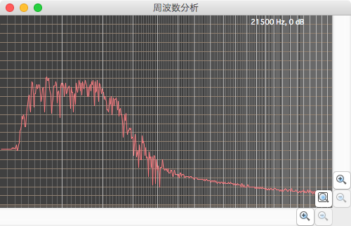
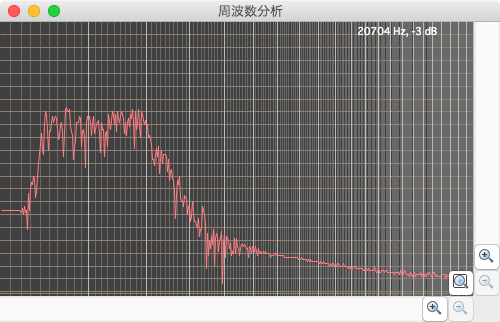

[Digital Filter](https://github.com/kantoku009/DigitalFilter)
====================
#はじめに
C++言語にてデジタルフィルタを作成した。  
WAVEファイルを読み込んで、デジタルフィルタに通すようにした。  
作成したフィルタは以下。

- Butterworth
- Chebycheff

GitHubのリポジトリと全ソースコードのダウンロードは以下URLから行える。

- [Githubのリポジトリ](https://github.com/kantoku009/DigitalFilter)
- [全ソースコードのダウンロード](https://github.com/kantoku009/DigitalFilter/archive/master.zip)

----

#UML
クラス図とシーケンス図を作成した。  
以下からダウンロード可能。  

 - [UML](https://github.com/kantoku009/DigitalFilter/blob/master/UML/DigitalFilter.asta?raw=true)

UMLの作成には無償のUMLモデリングツール[astah community](http://astah.change-vision.com/ja/)を使用している。  

クラスやメソッドの説明はdoxygenで生成した。  

- [クラスやメソッドの説明](./html/index.html)

----

#ビルド
<dl>
	<dt><strong>コマンド</strong></dt>
	<dd>Unix系のOSでビルドするのを想定している。</dd>
	<dd>以下コマンドが必要。</dd>
</dl>

	g++
	make

<dl>
	<dt><strong>make</strong></dt>
	<dd>zipファイルを解凍</dd>
	<dd>コマンドラインからカレントディレクトリの移動</dd>
	<dd>makeを実行</dd>
</dl>

	%unzip DigitalFilter-master.zip
	%cd ./source
	%make

<dl>
	<dt><strong>実行ファイル生成</strong></dt>
	<dd>以下の実行ファイルが出来上がる。</dd>
</dl>

	myfilter

#使用方法
使用方法は以下を参照。  

	%./myfilter [WAVEファイル名] [フィルタ種類]  

フィルタ種類は以下の数値を指定する。

 - 0 : Butterworth ローパスフィルタ
 - 1 : Butterworth バンドパスフィルタ
 - 2 : Butterworth ハイパスフィルタ
 - 3 : Chebycheff ローパスフィルタ
 - 4 : Chebycheff バンドパスフィルタ
 - 5 : Chebycheff ハイパスフィルタ

<dl>
	<dt><strong>設定ファイル</strong></dt>
	<dd>各フィルタの設定値は以下のファイルに記載されている。</dd>
</dl>

	./config/ButterworthLowPassFilter.conf
	./config/ButterworthBandPassFilter.conf
	./config/ButterworthHighPassFilter.conf
	./config/ChebycheffLowPassFilter.conf
	./config/ChebycheffBandPassFilter.conf
	./config/ChebycheffHighPassFilter.conf

----

#Butterworthフィルタ
ホワイトノイズをButterworthフィルタに通した結果を周波数解析した。  
ホワイトノイズをフィルタに通すことでフィルタの性能を測定することができる。(詳細は後述の参考情報「ホワイトノイズ」を参照)  

##ローパスフィルタ
###設定
Butterworthローパスフィルタの設定値は、以下のファイルから読み込む。  

	./config/ButterworthLowPassFilter.conf

フィルタの設定は、デフォルトでは以下のようにした。

- カットオフ周波数： 400[Hz]
- 1オクターブの減衰率： -48[db/oct]

##バンドパスフィルタ
###設定
Butterworthバンドパスフィルタの設定値は、以下のファイルから読み込む。  

	./config/ButterworthBandPassFilter.conf

フィルタの設定は、デフォルトでは以下のようにした。

- カットオフ周波数： 400[Hz]
- カットオフ周波数： 2000[Hz]
- 1オクターブの減衰率： -48[db/oct]

##ハイパスフィルタ
###設定
Butterworthハイパスフィルタの設定値は、以下のファイルから読み込む。  

	./config/ButterworthHighPassFilter.conf

フィルタの設定は、デフォルトでは以下のようにした。

- カットオフ周波数： 2000[Hz]
- 1オクターブの減衰率： -48[db/oct]

----

#Chebycheffフィルタ
ホワイトノイズをChebycheffフィルタに通した結果を周波数解析した。  
ホワイトノイズをフィルタに通すことでフィルタの性能を測定することができる。(詳細は後述の参考情報「ホワイトノイズ」を参照)  

##ローパスフィルタ
###設定
Chebycheffローパスフィルタの設定値は、以下のファイルから読み込む。  

	./config/ChebycheffLowPassFilter.conf

フィルタの設定は、デフォルトでは以下のようにした。

- カットオフ周波数： 400[Hz]
- 1オクターブの減衰率： -48[db/oct]

##バンドパスフィルタ
###設定
Chebycheffバンドパスフィルタの設定値は、以下のファイルから読み込む。  

	./config/ChebycheffBandPassFilter.conf

フィルタの設定は、デフォルトでは以下のようにした。

- カットオフ周波数： 400[Hz]
- カットオフ周波数： 2000[Hz]
- 1オクターブの減衰率： -48[db/oct]

##ハイパスフィルタ
###設定
Chebycheffハイパスフィルタの設定値は、以下のファイルから読み込む。  

	./config/ChebycheffHighPassFilter.conf

フィルタの設定は、デフォルトでは以下のようにした。

- カットオフ周波数： 2000[Hz]
- 1オクターブの減衰率： -48[db/oct]

----

#参考情報
##ホワイトノイズ
ホワイトノイズを周波数解析した。  
ホワイトノイズは全ての周波数に対して同じ強度となる性質を持っている。  
その為、ホワイトノイズをフィルタに通すことによって、フィルタの性能を確認することができる。  

ホワイトノイズのファイルは、以下のサイトから借用した。  
[High Quality White Noise | Play & Download .wav .mp3 Audio Files](http://www.audiocheck.net/testtones_whitenoise.php)

##周波数解析
周波数解析には音声編集ソフトWavePadというアプリケーションを利用した。  
以下のサイトからダウンローが可能。  
[WavePad 音声編集ソフト](http://www.nch.com.au/wavepad/jp/index.html?gclid=CLbS3J3y9MMCFRWSvQodjjYAqw)

##デジタルフィルタ
###サイト
デジタルフィルタに関しては以下サイトの[実用ディジタル信号処理講座 第3章 デジタルフィルタの基礎](http://www.sound.sie.dendai.ac.jp/dsp/Text/PDF/Chap3.pdf)を参考にした。  
[音響情報研究室](http://www.sound.sie.dendai.ac.jp/index-j.html)

###書籍
以下の書籍を参考にした。  
[「デジタルフィルタ (ビギナーズ)」  中村 尚五 (著)](http://www.amazon.co.jp/dp/4501313501/)

