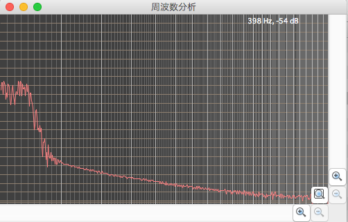
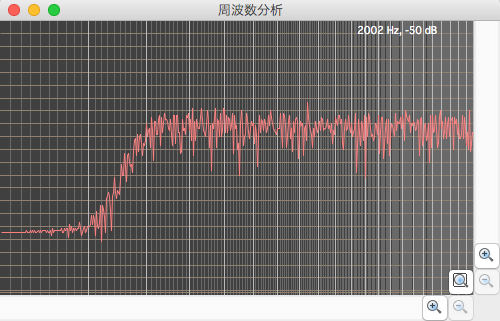
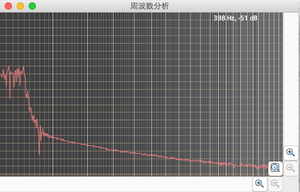
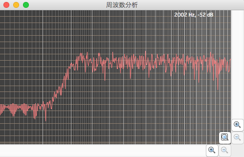
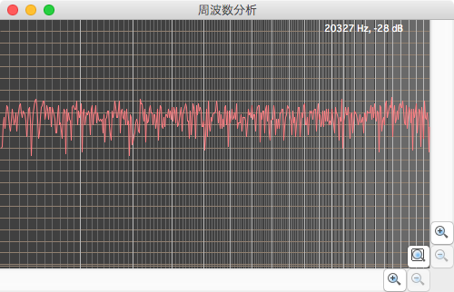

Digital Filter
====================
#はじめに
C++言語にてデジタルフィルタを作成した。  
作成したフィルタは以下。

- Butterworth
- Chebycheff

WAVEファイルを読み込んで、デジタルフィルタに通すようにした。  
全ソースコードのダウンロードは以下から行える。

- [DigitalFilter](https://github.com/kantoku009/DigitalFilter/archive/master.zip)

----

#ビルド
zipファイルを解凍し、コマンドラインから以下のディレクトリに移動。  

 - %cd ./source

makeを実行する。  

 - %make

以下の実行ファイルが出来上がる。

 - butterworth_filter
 - chebycheff_filter

使い方は以下。  

 - %./butterworth_filter [WAVEファイル名] [dB/oct]  
 - %./chebycheff_filter [WAVEファイル名] [dB/oct]  

dB/octは、1オクターブで何dB減衰させるかを指定する数値。

----

#Butterworthフィルタ
ホワイトノイズをButterworthフィルタに通した結果を周波数解析した。

##ローパスフィルタ
フィルタの設定は以下のようにした。

- カットオフ周波数： 400[Hz]
- 1オクターブの減衰率： -48[db/oct]

##ハイパスフィルタ
フィルタの設定は以下のようにした。

- カットオフ周波数： 2000[Hz]
- 1オクターブの減衰率： -48[db/oct]

----

#Chebycheffフィルタ
ホワイトノイズをButterworthフィルタに通した結果を周波数解析した。

##ローパスフィルタ
フィルタの設定は以下のようにした。

- カットオフ周波数： 400[Hz]
- 1オクターブの減衰率： -48[db/oct]

##ハイパスフィルタ
フィルタの設定は以下のようにした。

- カットオフ周波数： 2000[Hz]
- 1オクターブの減衰率： -48[db/oct]

----

#参考情報
##ホワイトノイズ
ホワイトノイズを周波数解析した。  
（ホワイトノイズは全ての周波数に対して同じ強度となる性質を持っている。）  

ホワイトノイズのファイルは、以下のサイトから借用した。  
[High Quality White Noise | Play & Download .wav .mp3 Audio Files](http://www.audiocheck.net/testtones_whitenoise.php)

##周波数解析
周波数解析には音声編集ソフトWavePadというアプリケーションを利用した。  
以下のサイトからダウンローが可能。  
[WavePad 音声編集ソフト](http://www.nch.com.au/wavepad/jp/index.html?gclid=CLbS3J3y9MMCFRWSvQodjjYAqw)

##デジタルフィルタ
###サイト
デジタルフィルタに関しては以下サイトの[実用ディジタル信号処理講座 第3章 デジタルフィルタの基礎](http://www.sound.sie.dendai.ac.jp/dsp/Text/PDF/Chap3.pdf)を参考にした。  
[音響情報研究室](http://www.sound.sie.dendai.ac.jp/index-j.html)

###書籍
以下の書籍を参考にした。  
[「デジタルフィルタ (ビギナーズ)」  中村 尚五 (著)](http://www.amazon.co.jp/dp/4501313501/)

